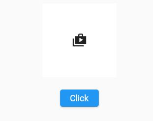

# flutter_animation Widgets

### AnimatedPhysicalModel Widget

[Source Code](lib/animatedPhysicalModelWidget.dart)

## Flutter Neumorphism
### Custom Neumorphism Button Widget

[Source Code](lib/CustomNeumorphismButton.dart)

### AnimatedPhysicalModel Widget

[Source Code](lib/AminatedNeumorphismButton.dart)

A few resources to get you started if this is your first Flutter project:

- [Cookbook: Useful Flutter samples](https://docs.flutter.dev/cookbook)

