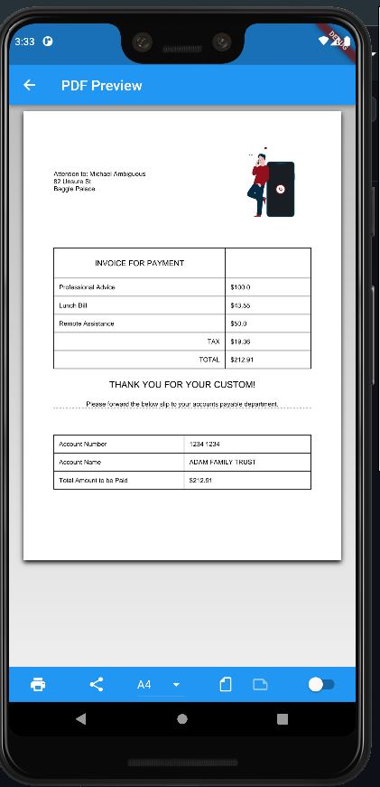

# flutter Create PDF

[Source Code](lib/)

## Getting Started

### 1st Step : Add pdf package <pdf> - package link <https://pub.dev/packages/pdf>
### 2st Step : Add printing package <printing> - package link <https://pub.dev/packages/printing>

## Output/Result

#### View Pdf

