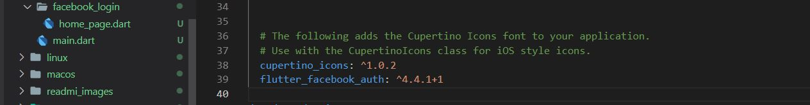
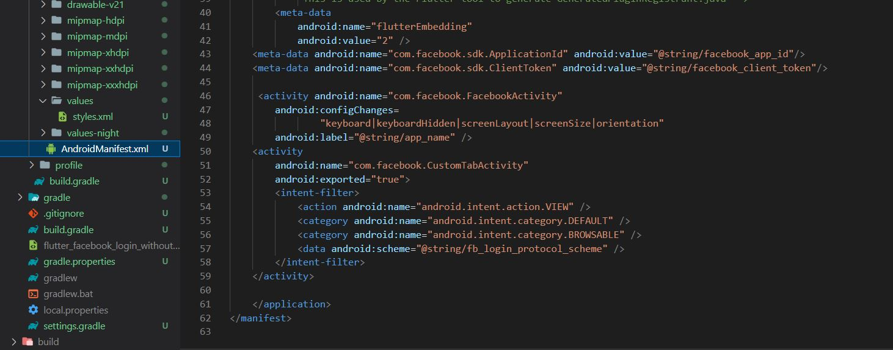
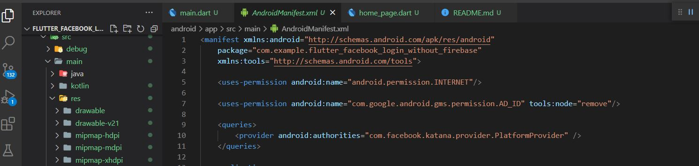
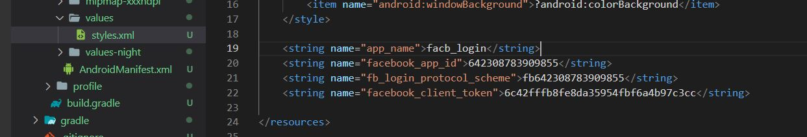

# flutter_facebook_login_without_firebase

[Source Code](lib/)

## Getting Started

### 1st step :- add pubspec.yaml <flutter_facebook_auth> package <https://pub.dev/packages/flutter_facebook_auth>

### 2nd step :- Login facebook developer account <https://developers.facebook.com/apps/>

### 3rd step :- Create App <https://developers.facebook.com/apps/>

### 4th step :- Create hashes Key 

To generate a development key hash, run the following command in a command prompt in the Java SDK folder:

	4.1 : - keytool -exportcert -alias androiddebugkey -keystore "C:\Users\USERNAME\.android\debug.keystore" | "PATH_TO_OPENSSL_LIBRARY\bin\openssl" sha1 -binary | "PATH_TO_OPENSSL_LIBRARY\bin\openssl" base64
	
4.2 :- Download openssl-for-windows file <https://code.google.com/archive/p/openssl-for-windows/downloads>

### 5th step :- Dashboard>Basic>Advance ### App id & facebook_client_token

#### Add Package

#### AndroidManifest

#### readmi_images

#### Android/Value/Styles.txt

	

