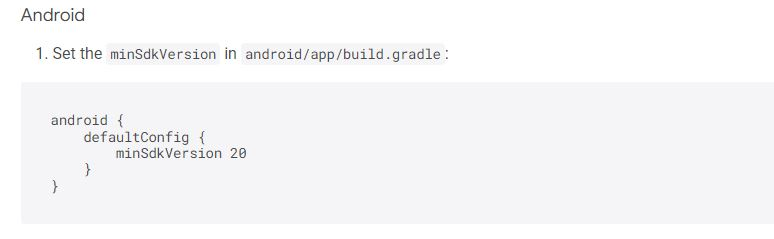
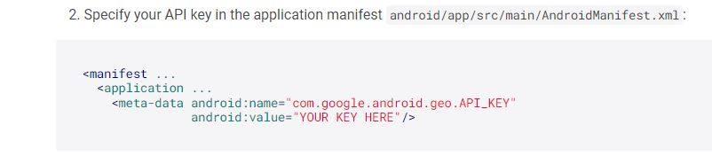
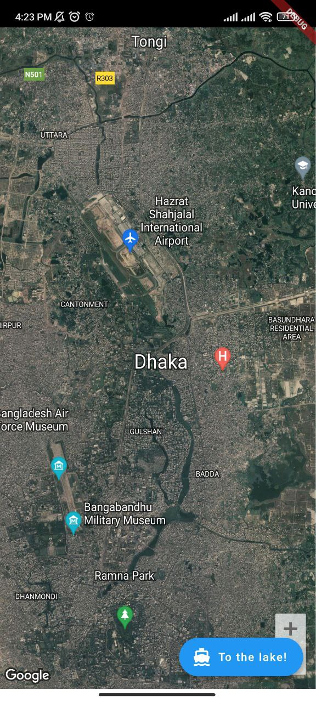

# flutter Google Map

[Source Code](lib/)

## Getting Started

### 1st Step : Add package <google_maps_flutter> - package link <https://pub.dev/packages/google_maps_flutter#google-maps-for-flutter>

### 2nd Step : Get an API key at <https://cloud.google.com/maps-platform/.>

### 3rd Step : Enable Google Map SDK for each platform.

* Go to Google Developers Console. <https://console.cloud.google.com/>
* Choose the project that you want to enable Google Maps on.
* Select the navigation menu and then select "Google Maps".
* Select "APIs" under the Google Maps menu.
* To enable Google Maps for Android, select "Maps SDK for Android" in the "Additional APIs" section, then select "ENABLE".
* To enable Google Maps for iOS, select "Maps SDK for iOS" in the "Additional APIs" section, then select "ENABLE".
* Make sure the APIs you enabled are under the "Enabled APIs" section.

#### Add AndroidminSDK /20+

#### Add AndroidManifest Under Application

## Output/Result

#### Home Page / Show Map

### Codelabs Site, google official <https://codelabs.developers.google.com/>
