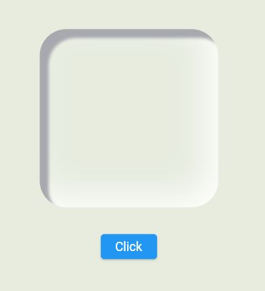

## Flutter Neumorphism
### Custom Neumorphism Button Widget

[Source Code](lib/CustomNeumorphismButton.dart)

### AnimatedPhysicalModel Widget

[Source Code](lib/AminatedNeumorphismButton.dart)

https://user-images.githubusercontent.com/83054722/181793495-ed1d217e-393b-418a-b02b-dad27f7a0312.mp4

