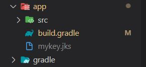
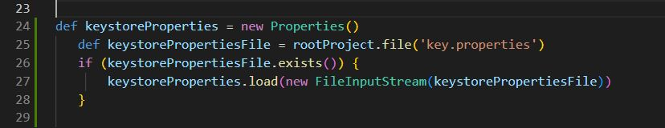
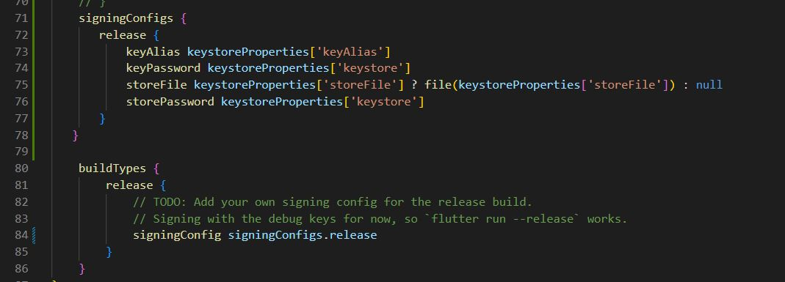

## Flutter Google SignIn without Firebase
### Google SignIn without Firebase

[Source Code](lib/)

#### create jks file

#### app gradle configuration

#### app gradle configuration

#### 

#### create jks file site>>>>

#####create jks key>>>>>>>>>>

  keytool -genkey -v -keystore %userprofile%\mykey.jks -storetype JKS -keyalg RSA -keysize 2048 -validity 10000 -alias androiddebugkey
  
#####jks pass[keystore]

Google cloud site link>>
[console.cloud.google.com](https://console.cloud.google.com/)
1. create credentials
2. create OAuth consent screen

